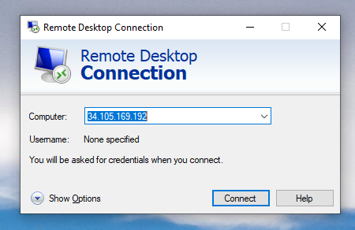
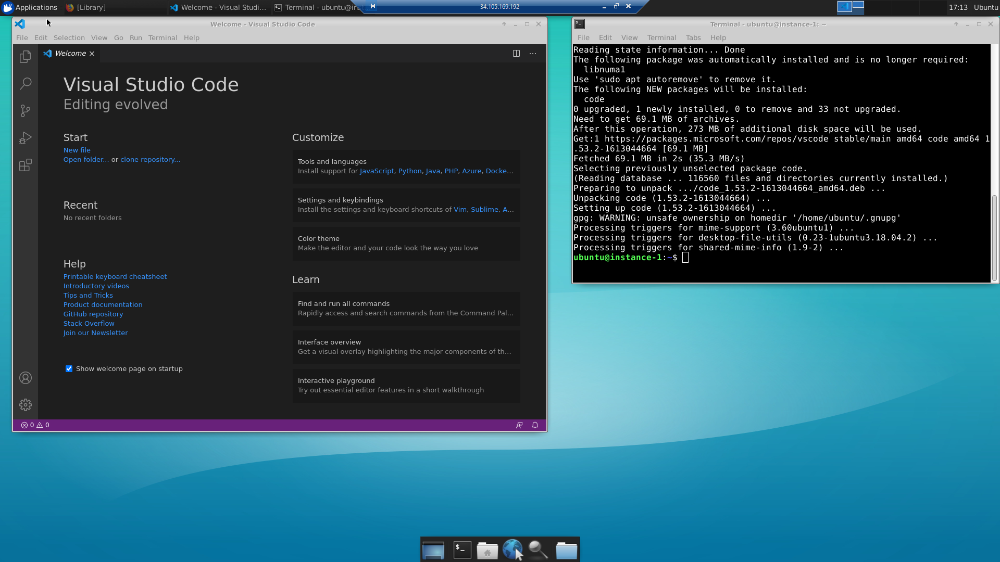
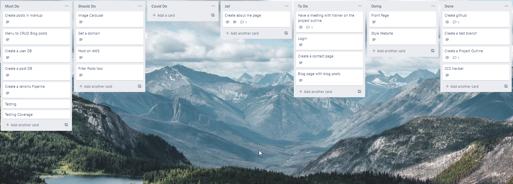
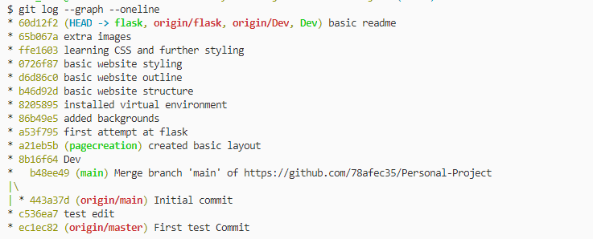

# Personal-Project - Website and Blog

Author: Suner Syuleyman

## Requirements to run

+ click 7.1.2
+ Flask 1.1.2
+ itsdangerous 1.1.0
+ Jinja2 2.11.3
+ MarkupSafe 1.1.1
+ Werkzeug 1.0.1

##  Development Environment Set-Up

### **Bootstrap Bash Script**

This sets up most of the environment.

    #!/bin/bash 
    apt-get update
    sudo su -
    useradd ubuntu
    sudo apt-get install build-essential xrdp xfce4 xfce4-terminal xfce4-goodies xorg dbus-x11 x11-xserver-utils software-properties-common apt-transport-https wget -y
    #Setting up XRDP
    sudo sed -i.bak '/fi/a #xrdp multiple users configuration \n xfce-session \n' /etc/xrdp/startwm.shsudo ufw allow 3389/tcp
    sudo /etc/init.d/xrdp restart
    sudo systemctl restart xrdp
    sudo apt-get install build-essential libcurl4-gnutls-dev libxml2-dev libssl-dev firefox -y
    sudo ufw allow 3389
    # setting up VSCode
    sudo apt update
    sudo apt install software-properties-common apt-transport-https -y
    wget -qO- https://packages.microsoft.com/keys/microsoft.asc | gpg --dearmor > packages.microsoft.gpg
    sudo install -o root -g root -m 644 packages.microsoft.gpg /etc/apt/trusted.gpg.d/
    sudo sh -c 'echo "deb [arch=amd64 signed-by=/etc/apt/trusted.gpg.d/packages.microsoft.gpg] https://packages.microsoft.com/repos/vscode stable main" > /etc/apt/sources.list.d/vscode.list'
    sudo apt update
    sudo apt install code -y

### **GCP Shell set up**

This snippet in the Google Cloud Shell allows RDP traffic through. 

    gcloud compute firewall-rules create allow-rdp --allow tcp:3389

### **User Configuration**

Final part is to create a user to allow the XRDP client to log in. This done via the in built SSH client in GCP. 

    sudo passwrd ubuntu 

Then you enter your password and log in via RDP:

## Software Design

### **Project management**

Trello has been used as the primary source of project management.

<https://trello.com/b/lOwC8NkE/personal-project>

### **Architecture**

## Programming/Software Development

### **Version Control System**

#### **GitHub**

I have used git and github to manage and store different version with different branches created for different features.

Public Git Page <https://github.com/78afec35/Personal-Project>

Clone Link <https://github.com/78afec35/Personal-Project.git>

### **Tools used**

+ Python
+ HTML
+ CSS
+ Flask
+ Jinja2
+ Jenkins
+ VS Code
+ Trello

## Testing

## Systems Integration and Build

## References

1. Kevin Powell - CSS Navbar - <https://www.youtube.com/watch?v=8QKOaTYvYUA&ab_channel=KevinPowell>
2. Background image - Langtang National Park, Nepal - Sergey Pesterev - <https://unsplash.com/@sickle>
3. Flask Tutorial - <https://flask.palletsprojects.com/en/master/tutorial/>
