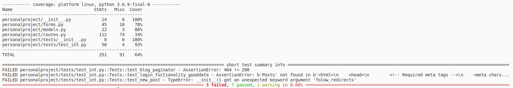
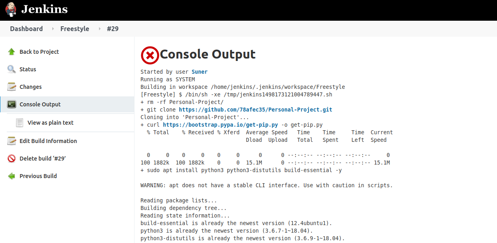
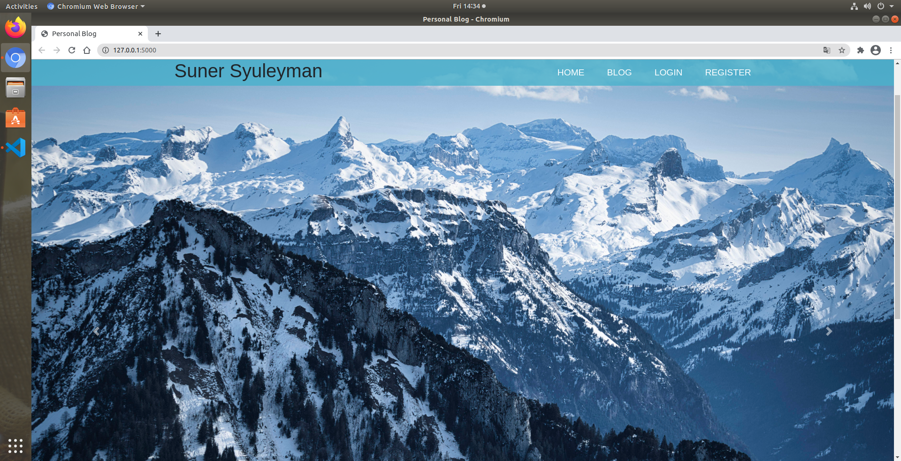
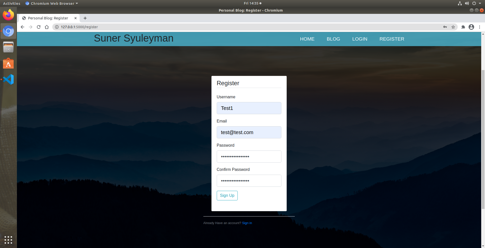
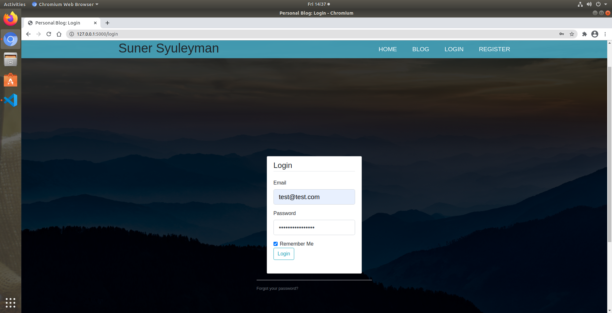
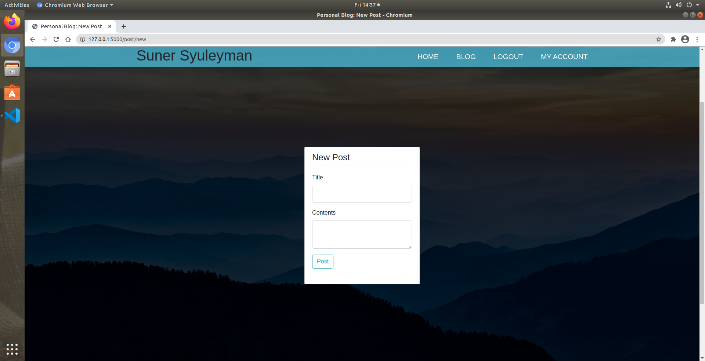
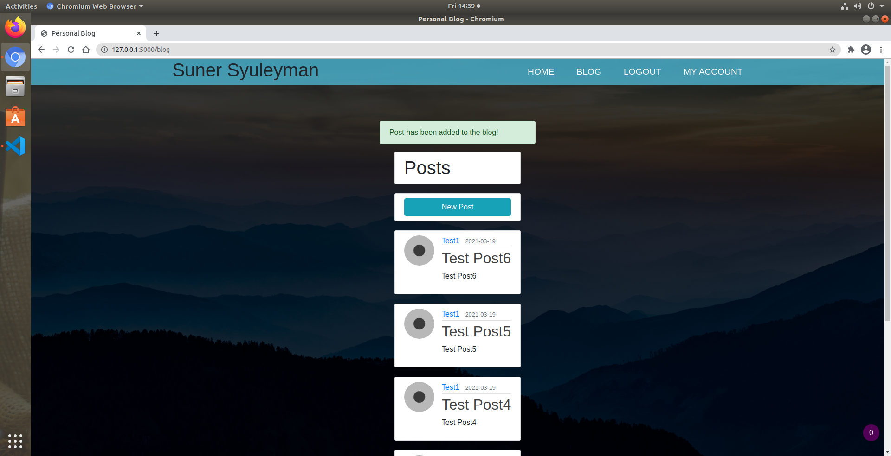
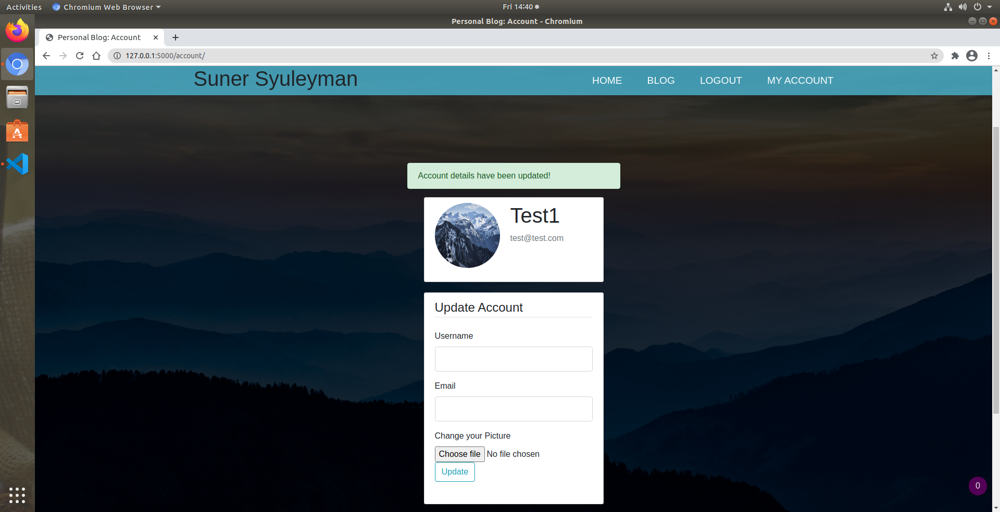
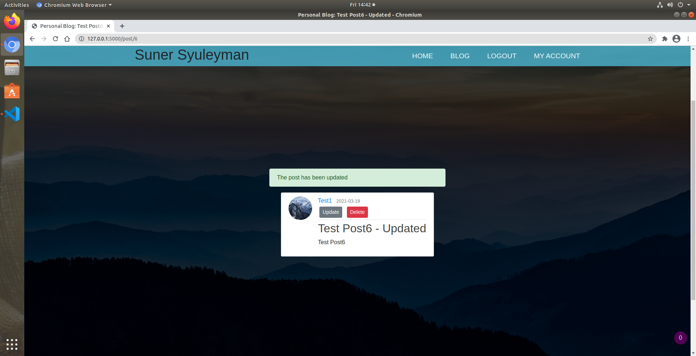
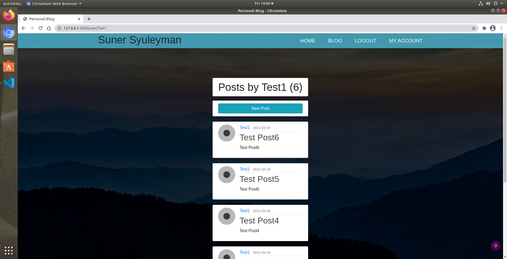

# Personal-Project - Website and Blog

Author: Suner Syuleyman

## Packages Used (Runtime Requirements)

### Core Utililites
+ click 7.1.2
+ Flask 1.1.2
+ itsdangerous 1.1.0
+ Jinja2 2.11.3
+ MarkupSafe 1.1.1
+ Werkzeug 1.0.1

### Extra Utilities

+ astroid 2.5
+ attrs 20.3.0
+ bcrypt 3.2.0
+ cffi 1.14.5
+ coverage 5.5
+ dnspython 2.1.0
+ email-validator 1.1.2
+ Flask-Bcrypt 0.7.1
+ Flask-CLI 0.4.0
+ Flask-Login 0.5.0
+ Flask-MySQL 1.5.2
+ Flask-SQLAlchemy 2.4.4
+ Flask-Testing 0.8.1
+ Flask-WTF 0.14.3
+ idna 3.1
+ importlib-metadata 3.7.2
+ iniconfig 1.1.1
+ is-disposable-email 1.0.0
+ isort 5.7.0
+ lazy-object-proxy 1.5.2
+ mccabe 0.6.1
+ packaging 20.9
+ Pillow 8.1.2
+ pkg-resources 0.0.0
+ pluggy 0.13.1
+ py 1.10.0
+ pycparser 2.20
+ pylint 2.7.1
+ pylint-flask 0.6
+ pylint-flask-sqlalchemy 0.2.0
+ pylint-plugin-utils 0.6
+ PyMySQL 1.0.2
+ pyparsing 2.4.7
+ pytest 6.2.2
+ pytest-cov 2.11.1
+ selenium 3.141.0
+ six 1.15.0
+ SQLAlchemy 1.3.23
+ toml 0.10.2
+ typed-ast 1.4.2
+ typing-extensions 3.7.4.3
+ urllib3 1.26.4
+ wrapt 1.12.1
+ WTForms 2.3.3
+ wtforms-validators 1.0.0
+ zipp 3.4.1

##  Development Environment Set-Up

### **Bootstrap Bash Script**

Once you have selected an Ubuntu 18.10 server from GCP. This sets up most of the environment.

    #!/bin/bash 
    apt-get update
    sudo su -
    useradd ubuntu
    sudo apt-get install build-essential xrdp xfce4 xfce4-terminal xfce4-goodies xorg dbus-x11 x11-xserver-utils software-properties-common apt-transport-https wget -y
    #Setting up XRDP
    sudo sed -i.bak '/fi/a #xrdp multiple users configuration \n xfce-session \n' /etc/xrdp/startwm.shsudo ufw allow 3389/tcp
    sudo /etc/init.d/xrdp restart
    sudo systemctl restart xrdp
    sudo apt-get install build-essential libcurl4-gnutls-dev libxml2-dev libssl-dev firefox -y
    sudo ufw allow 3389
    # setting up VSCode
    sudo apt update
    sudo apt install software-properties-common apt-transport-https -y
    wget -qO- https://packages.microsoft.com/keys/microsoft.asc | gpg --dearmor > packages.microsoft.gpg
    sudo install -o root -g root -m 644 packages.microsoft.gpg /etc/apt/trusted.gpg.d/
    sudo sh -c 'echo "deb [arch=amd64 signed-by=/etc/apt/trusted.gpg.d/packages.microsoft.gpg] https://packages.microsoft.com/repos/vscode stable main" > /etc/apt/sources.list.d/vscode.list'
    sudo apt update
    sudo apt install code -y

### **GCP Shell set up**

This snippet in the Google Cloud Shell allows RDP traffic through. 

    gcloud compute firewall-rules create allow-rdp --allow tcp:3389

### **User Configuration**

Final part is to create a user to allow the XRDP client to log in. This done via the in built SSH client in GCP. 

    sudo passwrd ubuntu 

Then you enter your password and log in via RDP:

## Software Design

### **Project management**

Trello has been used as the primary source of project management.

<https://trello.com/b/lOwC8NkE/personal-project>

### **Architecture**

### Tree Diagram
Flask Package Structure

    ├── create.py
    ├── instance
    │   └── flaskr.sqlite
    ├── personalproject
    │   ├── blog.db
    │   ├── forms.py
    │   ├── __init__.py
    │   ├── __init__.pyc
    │   ├── models.py
    │   ├── __pycache__
    │   │   ├── forms.cpython-36.pyc
    │   │   ├── __init__.cpython-36.pyc
    │   │   ├── models.cpython-36.pyc
    │   │   └── routes.cpython-36.pyc
    │   ├── routes.py
    │   ├── static
    │   │   ├── img
    │   │   │   ├── img1.jpg
    │   │   │   ├── img2.jpg
    │   │   │   ├── img3.jpg
    │   │   │   ├── img4.jpg
    │   │   │   └── userimages
    │   │   │       ├── 9214079e48edcd5b98a83aef.jpg
    │   │   │       ├── a636fc37db848b10921c0f27.jpg
    │   │   │       ├── d33711aa72875b0d1374fb42.jpg
    │   │   │       ├── dc8213501577cfdc994f81c0.jpg
    │   │   │       └── default.jpg
    │   │   └── styles
    │   │       └── style.css
    │   ├── templates
    │   │   ├── account.html
    │   │   ├── base.html
    │   │   ├── blog.html
    │   │   ├── contactme.html
    │   │   ├── create_post.html
    │   │   ├── index.html
    │   │   ├── login.html
    │   │   ├── post.html
    │   │   ├── register.html
    │   │   └── user_posts.html
    │   └── tests
    │       ├── __init__.py
    │       ├── __pycache__
    │       │   ├── __init__.cpython-36.pyc
    │       │   └── test_int.cpython-36-pytest-6.2.2.pyc
    │       └── test_int.py
    ├── __pycache__
    │   ├── forms.cpython-36.pyc
    │   └── personalproject.cpython-36.pyc
    ├── ReadmeAssets
    │   ├── git.png
    │   ├── RDP.png
    │   ├── tree.txt
    │   ├── Trello Example.png
    │   ├── trello.png
    │   └── XRDP.png
    ├── README.md
    ├── requirements.txt
    ├── start.py
    ├── tree.txt
    └── venv

### Architecture design

Three tier monolithic structure

    Web layer - HTML, CSS, JS
    |
    Application layer - Python, Flask, Jinja2
    |
    Database layer - MySQL(remote) , SQLite(local testing)

### **SWOT Analysis**
+ Strengths
    + Quick and easy to deploy
    + Agile and modular design
    + Quick to edit and introduce new features
    + Responsive website and systems
+ Weakneses
    + Many packages are used and that can introduce dependencies on all these packages being supported
    + Basic framework which means more complicated features might need an advanced framework
    + Rigid 3 tier architecture
    + Testing is incomplete without integration testing
    + Difficult to test the login functionality of flask
+ Opportunities
    + There are many features that I would like to add onto this website
    + It can be integrated with more features and packages
    + Can be expanded from an application package framework into an application factory, allowing for microservices deployment
+ Threats
    + In it's current state it is vulnerable to SQL injections and other threats such as having keys and passwords available inside the server.
    + Cannot scale easily in its present form.
    + No automatic measures to handle crashes/ errors and incidents.  

## Programming/Software Development

### **Version Control System**

#### **GitHub**

I have used git and github to manage and store different version with different branches created for different features.

Public Git Page <https://github.com/78afec35/Personal-Project>

Clone Link <https://github.com/78afec35/Personal-Project.git>

### **Tools used**

+ Jenkins
+ VS Code
+ Trello
+ Google Chrome
+ Google Cloud Platform (GCP)
+ Ubuntu 18.10
+ Bootstrap 4.0

## Testing

### **Unit testing**

Flask authentication decorator has been causing problems with unit testing. As such I couldn't get a very high coverage on these tests. If we were allowed to use something like Selenium I would have been able to carry out full testing whilst circumventing flask's limitations. This is due to the complexity of this app and there being many interdependent components.

Overall Coverage 64%

## Systems Integration and Build

### **Jenkins**

### Jenkins Set-up
Jenkins set up script courtesy of Dara

    #!/bin/bash
    if type apt > /dev/null; then
        pkg_mgr=apt
        java="openjdk-8-jre"
    elif type yum /dev/null; then
        pkg_mgr=yum
        java="java"
    fi
    echo "updating and installing dependencies"
    sudo ${pkg_mgr} update
    sudo ${pkg_mgr} install -y ${java} wget git > /dev/null
    echo "configuring jenkins user"
    sudo useradd -m -s /bin/bash jenkins
    echo "downloading latest jenkins WAR"
    sudo su - jenkins -c "curl -L https://updates.jenkins-ci.org/latest/jenkins.war --output jenkins.war"
    echo "setting up jenkins service"
    sudo tee /etc/systemd/system/jenkins.service << EOF > /dev/null
    [Unit]
    Description=Jenkins Server

    [Service]
    User=jenkins
    WorkingDirectory=/home/jenkins
    ExecStart=/usr/bin/java -jar /home/jenkins/jenkins.war

    [Install]
    WantedBy=multi-user.target
    EOF
    sudo systemctl daemon-reload
    sudo systemctl enable jenkins
    sudo systemctl restart jenkins
    sudo su - jenkins << EOF
    until [ -f .jenkins/secrets/initialAdminPassword ]; do
        sleep 1
        echo "waiting for initial admin password"
    done
    until [[ -n "\$(cat  .jenkins/secrets/initialAdminPassword)" ]]; do
        sleep 1
        echo "waiting for initial admin password"
    done
    echo "initial admin password: \$(cat .jenkins/secrets/initialAdminPassword)"
    EOF

### Configuration script 

 This makes the script running on the Jenkins server

    rm -rf Personal-Project/
    git clone https://github.com/78afec35/Personal-Project.git
    curl https://bootstrap.pypa.io/get-pip.py -o get-pip.py
    sudo apt install python3  python3-distutils build-essential -y
    python3 get-pip.py
    export PATH='/home/jenkins/.local/bin'
    cd ./Personal-Project
    pwd
    pip install -r requirements.txt
    py.test --cov=personalproject personalproject/tests/

### **Features**

### Front Page

### Register/Login

### Blog

### Modify account credentials / Picture

### Post update/delete

### Post filter by user

## References

1. Kevin Powell - CSS Navbar - <https://www.youtube.com/watch?v=8QKOaTYvYUA&ab_channel=KevinPowell>
2. Corey Schafer - Tutorials - <https://www.youtube.com/channel/UCCezIgC97PvUuR4_gbFUs5g>
3. Background image - Langtang National Park, Nepal - Sergey Pesterev - <https://unsplash.com/@sickle>
4. Flask Tutorial - <https://flask.palletsprojects.com/en/master/tutorial/>
